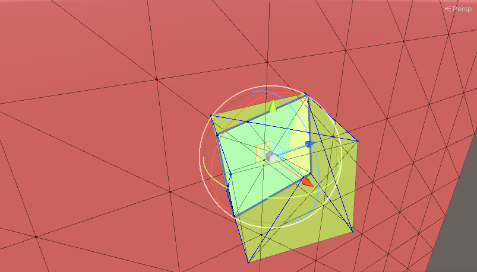

# TestECSMesh

## Preface

**This is an old repo** (Apr 2020).

The only changes from the original codes are
some packages updates to use a more recent version of unity,
this `README.md`,
the `.gitignore`,
and some screenshots that are more recent, just to showcase some things.

## Small history

### Goal

Implementing some mesh intersection algorithms first taking advantage of Burst compiler, and then potentially with unity Job System.

The name of the repo, namely "TestECSMesh" comes from the fact that the original idea was to use the whole Unity ECS Ecosystem.  

### First result obtained

The points of intersection between two pyramids were succesfully calculated.
This was done in order to consider just basic triangle-based shapes.

### First mesh reconstruction

The next whing was to reconstruct the mesh from those points.

### More complex examples

Next, the intersection between more complex and triangle-dense meshes.

### Additional implementation

The last thing that was succesfully implemented was the math to 
cut in half meshes.
The implemented example was carried out cutting a plane mesh with a math defined plane.

In particular:
- The green line represents the normal of the cutting plane
- The red lines represents the triangle edges intersected by said plane
- The green and blue dots are the vertices that are respectively
"up" and "down" with respect to the cutting plane, with "up" being congruent with its normal

